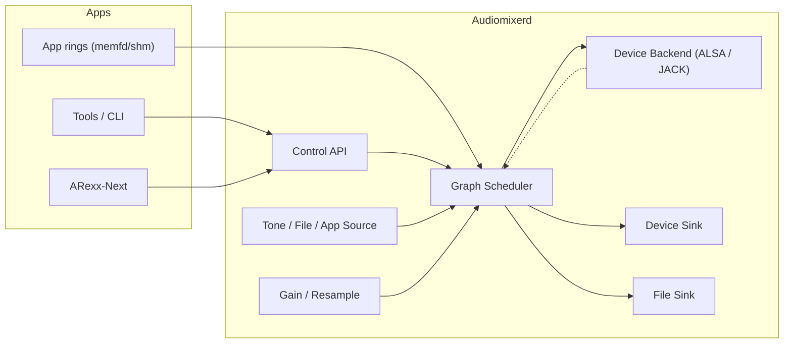

# audiomixerd

**CopperlineOS low‑latency audio graph.**  
`audiomixerd` is a small, deterministic audio engine inspired by AHI on Amiga: apps connect **nodes** (sources, effects, mixers, sinks) into a graph that runs on a hard **deadline schedule**. Phase‑0 targets Linux with **ALSA** (default) and **JACK** backends and a JSON control protocol over a Unix domain socket.

> TL;DR: an audio graph that prioritises **latency and stability** over maximal features. It boots fast, mixes cleanly, and won’t glitch under load.

---

## Why it exists

General‑purpose audio stacks are flexible but can introduce jitter. CopperlineOS aims for **deterministic media**: `audiomixerd` provides a predictable, deadline‑driven engine that pairs with `compositord`/`copperd` so sound and visuals stay in lockstep.

- **Deterministic scheduling** aligned to the device period.  
- **Small, explicit node set** (gain, mixer, resampler, device sinks/sources, tone/file/app sources).  
- **Per‑app rings** with backpressure and underrun telemetry.  
- **Scriptable** JSON control (binary ring later).

---

## Status

- Phase‑0 JSON protocol: **stable‑ish (v0)**  
- Backends: **ALSA** (default), **JACK** (optional)  
- Format: internal **float32, 48 kHz**, per‑node resamplers for other rates  
- Language: Rust  
- License: MIT OR Apache‑2.0

---

## Architecture (Phase‑0)



<details>
<summary>Text-only fallback (if Mermaid fails)</summary>

```
Apps (rings) -> Graph Scheduler
Tools/ARexx -> Control API -> Graph Scheduler
Sources (Tone/File/App) -> Graph Scheduler <- FX (Gain/Resample)
Graph Scheduler -> { Device Sink, File Sink } ; Device Backend <-> Graph Scheduler (clock/period)
```
</details>

- **Control plane**: JSON messages to create nodes and connections.  
- **Data plane**: lock‑free ring buffers; scheduler runs per device period (e.g., 128 frames @ 48 kHz).  
- **Clock**: audio device clock is authoritative; drift vs system clock is measured and reported.

---

## Concepts

- **Node**: processing element with typed ports (audio in/out, control).  
- **Graph**: directed acyclic graph evaluated topologically each period.  
- **Period**: fixed number of frames processed atomically (e.g., 64/128/256).  
- **Format**: internal `f32, 48 kHz, interleaved stereo` (Phase‑0); resamplers adapt inputs.  
- **Rings**: per‑app shared buffers (memfd/shm) with watermarks and timestamps.  
- **XRUN**: underrun/overrun; surfaced as telemetry and events.

---

## Protocol (Phase‑0 JSON, v0)

**Socket (default):** `/run/copperline/audiomixerd.sock`  
Configurable via `AUDIOMIXERD_SOCKET`.

### Client → `audiomixerd`

- `{"cmd":"ping"}` → `{"ok":true,"name":"audiomixerd","version":"0.1.0"}`
- `{"cmd":"backend","driver":"alsa|jack"}`
- `{"cmd":"device_open","name":"default","rate":48000,"channels":2,"period":128}`
- `{"cmd":"create_node","type":"tone","args":{"freq":440}}` → `{"ok":true,"id":1}`
- `{"cmd":"create_node","type":"file_source","args":{"path":"/tmp/test.wav"}}` → `{"id":2}`
- `{"cmd":"create_node","type":"app_source","args":{"memfd":17,"frames":4096,"channels":2,"rate":44100}}` → `{"id":3}`
- `{"cmd":"create_node","type":"gain","args":{"db":-6.0}}` → `{"id":4}`
- `{"cmd":"create_node","type":"resample","args":{"rate":44100}}` → `{"id":5}`
- `{"cmd":"create_node","type":"device_sink"}` → `{"id":6}`
- `{"cmd":"connect","from":1,"to":6}`
- `{"cmd":"connect","from":2,"to":4}`; `{"cmd":"connect","from":4,"to":6}`
- `{"cmd":"start"}` / `{"cmd":"stop"}`
- `{"cmd":"subscribe","events":["xrun","stats","state"]}`

### Events (server → client)

- `{"event":"state","value":"running"}`  
- `{"event":"xrun","type":"underrun","usec":341,"node":6}`  
- `{"event":"stats","cpu_pct":2.3,"period":128,"late_us":0}`

**Notes**
- Nodes are reference‑counted; `disconnect`/`destroy_node` frees them when unused.  
- `app_source` shares memory via a memfd descriptor; producer writes frames + timestamps.  
- `file_source` is for demos/tests; real apps should stream via `app_source`.

---

## Quick start

### 1) Run audiomixerd

```bash
git clone https://github.com/CopperlineOS/audiomixerd
cd audiomixerd
cargo build --release
RUST_LOG=info ./target/release/audiomixerd
```

Environment variables:

- `AUDIOMIXERD_SOCKET=/run/copperline/audiomixerd.sock`  
- `AUDIOMIXERD_BACKEND=alsa|jack` (default: `alsa`)  
- `AUDIOMIXERD_PERIOD=128` (frames)  
- `AUDIOMIXERD_DEVICE=default|hw:0,0`

### 2) Make a simple graph (tone → gain → device)

```bash
# open device (48kHz stereo, period 128)
portctl /run/copperline/audiomixerd.sock   '{"cmd":"device_open","name":"default","rate":48000,"channels":2,"period":128}'

# create nodes
portctl /run/copperline/audiomixerd.sock '{"cmd":"create_node","type":"tone","args":{"freq":440}}'
portctl /run/copperline/audiomixerd.sock '{"cmd":"create_node","type":"gain","args":{"db":-6.0}}'
portctl /run/copperline/audiomixerd.sock '{"cmd":"create_node","type":"device_sink"}'

# connect tone -> gain -> sink
portctl /run/copperline/audiomixerd.sock '{"cmd":"connect","from":1,"to":2}'
portctl /run/copperline/audiomixerd.sock '{"cmd":"connect","from":2,"to":3}'

# start the engine
portctl /run/copperline/audiomixerd.sock '{"cmd":"start"}'
```

You should hear a -6 dB 440 Hz sine tone with low latency.  
Subscribe to stats:

```bash
portctl /run/copperline/audiomixerd.sock '{"cmd":"subscribe","events":["stats","xrun"]}'
```

---

## Building from source

```bash
# Toolchain
rustup default stable
rustup component add rustfmt clippy

# Optional system libraries:
# - ALSA dev headers, JACK (if using JACK), libsndfile (for file_source)

# Build & test
cargo fmt --all
cargo clippy --all-targets -- -D warnings
cargo test
```

Minimum Rust: **1.78+**.

---

## Development guide

- **Crates**: `audiomixerd-core` (graph, nodes, scheduler), `audiomixerd-ipc` (protocol), `audiomixerd-backend` (ALSA/JACK), `audiomixerd-bin` (daemon).  
- **Scheduling**: pull‑model; topological order; per‑period budget with late‑frame accounting.  
- **Resampling**: high‑quality band‑limited (default), fast linear (optional).  
- **Rings**: lock‑free single‑producer/single‑consumer; timestamps for drift stats.  
- **XRUN handling**: zero‑fill on underrun; stats events; optional watchdog.  
- **Sync with video**: expose audio time to `copperd` for A/V alignment (planned API).

---

## Roadmap

- **v0.1**: ALSA backend, tone/gain/mixer/resample/device sink/source, file source/sink, stats & xrun events.  
- **v0.2**: JACK backend parity, MIDI clock/sync input, channel map node.  
- **v0.3**: Spatial mixer (stereo→HRTF), LADSPA/LV2 bridge (curated).  
- **v0.4**: Network audio (RTP/Opus) nodes; loopback tap for streaming/recording.  
- **v0.5**: Security caps (node quotas), binary control protocol.

RFCs will be tracked in [`CopperlineOS/rfcs`](https://github.com/CopperlineOS/rfcs).

---

## Contributing

We welcome issues and PRs!

1. Read `CONTRIBUTING.md`.  
2. Check **good first issue** / **help wanted** labels.  
3. Node or protocol additions → open an RFC and link it in your PR.

Code of Conduct: `CODE_OF_CONDUCT.md`.

---

## Security

Prefer running as an unprivileged user. For low latency, `audiomixerd` may request real‑time scheduling via **rtkit** or `CAP_SYS_NICE`. Keep device ACLs minimal.  
Report vulnerabilities to **security@copperline.os** (placeholder) or via GitHub advisories. See `SECURITY.md`.

---

## License

Dual‑licensed under **Apache‑2.0 OR MIT**.

---

## See also

- [`compositord`](https://github.com/CopperlineOS/compositord): Vulkan/KMS compositor (vsync clock for visuals)  
- [`copperd`](https://github.com/CopperlineOS/copperd): timeline engine (drive A/V events)  
- [`ports`](https://github.com/CopperlineOS/ports): message‑port protocol & client libs  
- [`examples/audio-graph`](https://github.com/CopperlineOS/examples): sample graphs and utilities
